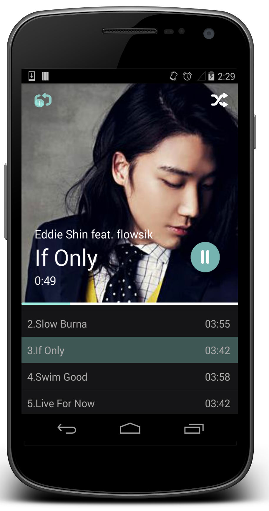

Musixygen
=========

[demo linke](https://www.youtube.com/watch?v=ECz39r0BjFY&feature=youtu.be)
Musixygen App Preview

#### App developement stages:
* MainActivity Polished
* ~~Integration slidingmenu and .mp3 listview~~
* Searching and social network integradtion

#### Features:
* 3 playing modes: Single repeat, Shuffle and Play in order(Default)
* Multi-threading reduces load of UI thread.
* musiXmatch-like item menu.
* Right slidingMenu
* Customized UI
* Using [Tagr for Mac](http://www.macupdate.com/app/mac/30610/tagr) to set your mp3s' properties.
* ~~iOS like transparent statusbar and navigation bar~~.
* ~~Choosing MediaPlayer instead of Soundpool or AudioTrack.~~ [Difference in details](http://www.wiseandroid.com/post/2010/07/13/Intro-to-the-three-Android-Audio-APIs.aspx)

=
Known Issues:
- ~~Play and Pause not integrated in one Button.~~
- ~~Actionbar has not been removed. (Android actionbar sherlock to make it fully transparent)~~
- ~~Hardcoding on read .mp3 media.~~
- ~~Sliding Menu~~ / Splash Screen have not been implemented.
- ~~Progress bar~~(Need Overlay effect)
- ~~Read Android local storage~~
- ~~Flexible Album info() to retrieve more properties from an mp3~~ [Google API](http://developer.android.com/reference/android/media/MediaMetadataRetriever.html)
- Overlay Progressbar
- Auto searching related song put into a list(parser)
- ~~Play songs in single repeat, repeat all, order, shuffle~~ [Google API](http://developer.android.com/reference/android/media/MediaPlayer.html#setOnCompletionListener(android.media.MediaPlayer.OnCompletionListener))
- Issues during the developement process will be stated in detail in sidebar `issues`

#### Thanks list:
* Big thanks and respect for the APP UI inspiration from **Kareativa Studio** : [iOS7 Simple Music Player App](https://dribbble.com/shots/1142984-iOS7-Simple-Music-Player-App?list=users&offset=34)
* jfeinstein10/SlidingMenu
